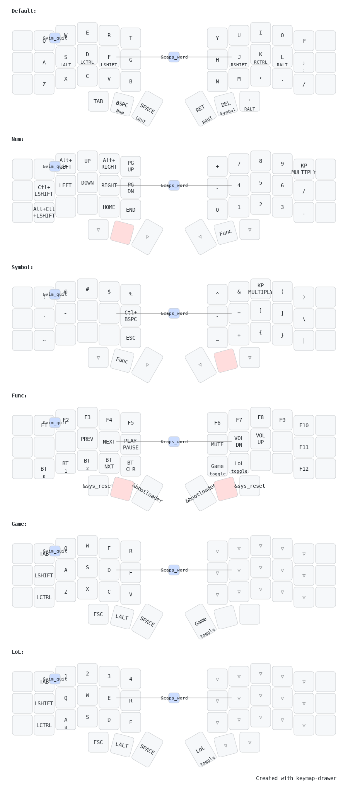

# ZMK Config

This repository contains the configuration files for my ZMK setup for Corne 3x5+3 (36 keys).

## Layout

## Acknowledgements

- [ZMK Firmware](https://zmk.dev/) - The open-source firmware used in this project.
- [keymap-drawer](https://github.com/caksoylar/keymap-drawer) - Nice visuals
